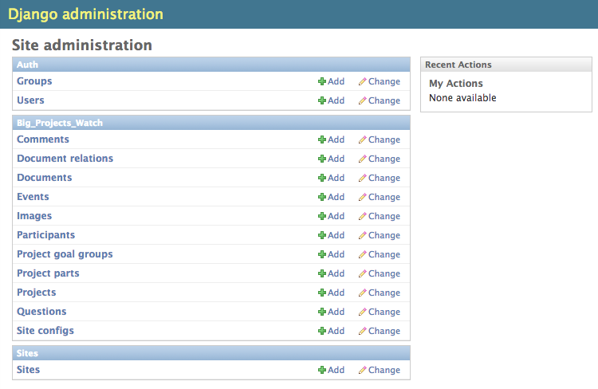
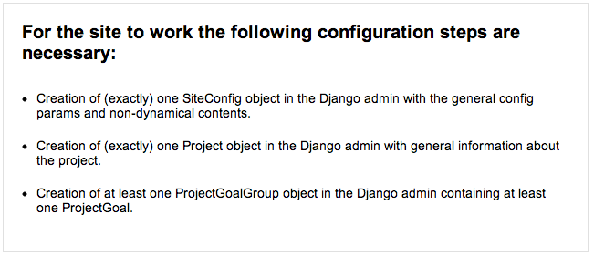

====================
Developers (UPDATED)
====================

Installation
============

BPW comes as a ``Django`` app providing all the data models necessary and the templates for the front end
layout. This app can be integrated in a ``Django`` project representing the concrete project to be targeted.

Requirements
------------
You need the following ``Python/Django`` libraries, probably best installed in an own ``virtualenv`` environment:

* Python 2.7+ (earlier versions untested)
* `Django <https://www.djangoproject.com/>`_ 1.4+ (earlier versions untested)
* `PDFMiner <http://www.unixuser.org/~euske/python/pdfminer/index.html>`_
* `Python Image Library PIL <http://www.pythonware.com/products/pil/>`_ 1.1.7+ (for Django ImageField type)
* `ImageMagick (convert tool) <http://www.imagemagick.org/>`_

If you want to keep track with changes in the DB model, ``South`` will be your friend:

* `South <http://south.aeracode.org/>`_ 0.7.6+ (earlier versions untested)

Installation
------------
First install the requirements above. Since BPW is work in progress, it is recommended to install
the latest source files directly from the GitHub repository with ``PIP``::

	pip install -e git+https://github.com/holgerd77/django-big-projects-watch.git@master#egg=django-big-projects-watch

Create your ``Django`` project::

	django-admin.py startproject myprojectwatch

Add the Django apps installed to your ``settings.py`` file (of course you also need the admin app which
is essential for BPW)::

	INSTALLED_APPS = (
	    ...
	    'django.contrib.admin',
	    'big_projects_watch',
	    'south',
	)

Sync your database respectively use migrations for BPW::

	python manage.py syncdb
	python manage.py migrate

Configuration
-------------

BPW is not really an app which you would install beside many other Django apps and integrate it in a more
complex website. It is more a content management system already coming with an url structure and a given
layout capsuled in a single app. So BPW takes control of more things than the normal Django app.

URL structure
^^^^^^^^^^^^^
The urlpatterns for your project are completely coming from BPW, with an exception of the admin url,
which should be adoptable for security reasons. So your minimal urls.py should look similar to this,
importing the main url patterns from ``big_projects_watch.urls``::

	from django.conf.urls import patterns, include, url

	from django.contrib import admin
	admin.autodiscover()
	
	from big_projects_watch.urls import urlpatterns
	
	urlpatterns += patterns('',
	    url(r'^admin/', include(admin.site.urls)),
	)

Now you should be able to enter the admin view when you start a dev server. The site itself is not yet
ready for prime time at this moment.

Basic settings
^^^^^^^^^^^^^^
Since I'm not sure, if there are still some static references to static or media files somewhere in the code,
you should use the following ``STATIC_URL`` and ``MEDIA_URL`` settings::

   MEDIA_URL = '/media/'
   STATIC_URL = '/static/'
   
BPW also needs the following setting (probably deprecated in the future)::

	WITH_PUBLIC_DOCS = True
	

BPW extends the Django user profile to add some custom user functionality. For this to work, you need to
add the following to your ``settings.py``::

	AUTH_PROFILE_MODULE = 'big_projects_watch.UserProfile'

For being able to get email notifications about comments and document relations, you need to configure
the Django email settings properly::

	EMAIL_FROM = 'admin@yourmailaccount.com'
	EMAIL_HOST = 'smtp.yoursmtpserver.com'
	EMAIL_HOST_USER =  'YOURUSERNAME'
	EMAIL_HOST_PASSWORD = 'YOURSECUREPASSWORD'
   

BPW uses the request template context processor in its views, so add it to the ``settings.py`` file::
   
   TEMPLATE_CONTEXT_PROCESSORS = (
	    "django.contrib.auth.context_processors.auth",
	    "django.core.context_processors.debug",
	    "django.core.context_processors.i18n",
	    "django.core.context_processors.media",
	    "django.core.context_processors.static",
	    "django.core.context_processors.tz",
	    "django.contrib.messages.context_processors.messages",
	    "django.core.context_processors.request", #this line!
   )

And finally you need to enter a correct domain name (no leading ``http://``) for your Site app in the
Django admin. This is for links in mails to work properly.

Language Selection
^^^^^^^^^^^^^^^^^^
At the moment BPW supports the following languages:

* English (en) (experimental and not yet used in production, probably you have to correct some stuff)
* German (de)

The language is chosen depending on the ``LANGUAGE_CODE`` param in the ``settings.py`` module, e.g.::

	LANGUAGE_CODE = 'de-de'

Initial project data
--------------------
For the site to be properly displayed, you have to enter some initial project data. When you open the
main url of your dev server, you should see a message similar to the following. Please follow the
instructions.

Document upload/viewer
----------------------
The document viewer in BPW is based on the Mozilla pdf.js library (included in BPW) when using modern
browsers or a viewer displaying png files for single pdf pages when using the Microsoft Internet Explorer.
For the viewer to work on MSIE you need to have the ``ImageMagick`` library installed and make sure
that the ``convert`` command from this library can be used from within your project path.

Documents are saved as the original pdf file and a corresponding document_x folder containing the pngs in
your media folder. Please test-upload a pdf document and see if these files are generated. Then test
the url with the pdf viewer for this document in both the MSIE and another browser.

.. note:: The conversion process of a pdf document takes place in the background and may take a while
          for large documents.

How to contribute: Translation
==============================

The main area for contribution for this project is translation, since the scope of the software is relatively
wide. So if you have got some time, speak English as a base language and another language like Spanish, Russian, 
French,... you are very welcome to help out (you don't need to be a developer for this task)!

You find the basic english language file called ``django.po`` on the 
`BPW GitHub Page <https://github.com/holgerd77/django-big-projects-watch>`_
in the following folder::
	
	big_projects_watch/locale/en/LC_MESSAGES/
	
Open this file and copy its contents. Then write the translation of the ``msg`` id strings between the 
double quotes after the ``msstr`` attribute. For longer strings you can use a format like this::

	#: models.py:123
	msgid "Structural parts of the project being stable over time."
	msgstr ""
	"Structural parts of the project being stable over time, e.g. 'Terminals', "
	"'Gates', 'Traffic Control', 'Integration of Public Transportation', not too "
	"much (<10), often useful as well: one entry for the project as a whole."
	
Just replace the ``msgstr`` with the translation in your language. If there is already a ``msgstr`` in 
english in the ``django.po`` file, use this string as a translation basis instead of ``msgid`` and
replace the english string with your language translation.

When you are ready with your translation open an issue on GitHub and past your text there or (advanced
developer version) make a pull request.

.. note:: If you have got limited time: please choose accuracy over speed, it's more helpful if you translate
          20 strings in an appropriate manner and take some time to think about the translation than translating
          50 strings and often missing the context or have spelling errors!

Generating/compiling message files
==================================

For generating the message files for a specific locale from the source identifiers, change to the ``big_projects_watch``
app directory and generate the message file for the desired locale with::

	django-admin.py makemessages -l de

Then translate the missing identifier strings and compile the message files with::

	django-admin.py compilemessages

Development Notes
=================

When ``DEBUG`` is set to ``True`` in ``settings.py``, ``404 template`` can be tested via the following
url::

	http://yourdevelopmenturl/404test/

Release Notes
=============

**Changes in version 0.2-alpha** (2013-01-22)

* Layout based on Twitter Bootstrap
* Participants, ProjectParts, ProjectGoals, Events as basic project entities
* Modeling of questions around the project
* Document upload / PDF viewer based on pdf.js
* Crowdsourcing of comments / document relations

**Changes in version 0.1-pre-alpha** (2012-08-08)

* Initial verion

