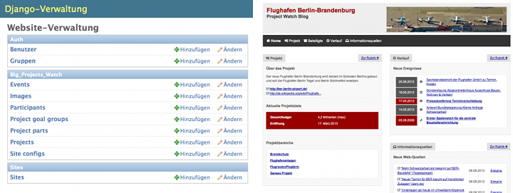

.. django-big-projects-watch documentation master file, created by
   sphinx-quickstart on Mon Aug  6 14:08:32 2012.
   You can adapt this file completely to your liking, but it should at least
   contain the root `toctree` directive.

django-big-projects-watch - Documentation
=========================================

Some intro text of what is it about (not too detailed)
What is the problem?
What is the software doing?

Features
--------
* f1
* f2

Warning note: still pre-alpha

Manual
------

.. toctree::
   :maxdepth: 2
   
   users
   developers

Indices and tables
==================

* :ref:`genindex`
* :ref:`modindex`
* :ref:`search`

