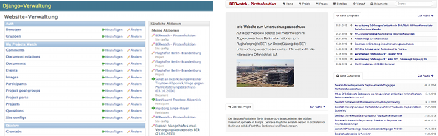

.. django-big-projects-watch documentation master file, created by
   sphinx-quickstart on Mon Aug  6 14:08:32 2012.
   You can adapt this file completely to your liking, but it should at least
   contain the root `toctree` directive.

django-big-projects-watch - Documentation
=========================================

.. warning:: At the moment, these docs are a pretty outdated, since we were busy setting up the first
             productive instance of this software. I'll try to fix this in the coming weeks and will
             mark all updated doc sections with an *UPDATED* appendix. If you are interested in the 
             software and have questions, please contact me on GitHub or Twitter 
             (`@HolgerD77 <https://twitter.com/HolgerD77>`_).
             
             Berlin, January 18th, 2013

Django Big Projects Watch (BPW) is a specialized open source content management system build with ``Python/Djano``.
Its goal is to **support the civic oversight of big - often publicly funded - projects** by providing a way
to frame the complex structure of a project and model its particpants, central parts of the projects,
main events and the interconnections between these entities.

At the moment the software is being used by the pirate party in the parliament of Berlin to monitor the
progress of the **Berlin-Brandenburg airport project**: https://ber.piratenfraktion-berlin.de

The **source code** of the software can be found on `GitHub <https://github.com/holgerd77/django-big-projects-watch>`_.

Features
--------
* **Admin interface** to model the relevant entities of a project (project parts, participants, project goals, events), interconnections between them
* **Upload of documents** and integrated pdf viewer (thanks to `Mozilla pdf.js <http://mozilla.github.com/pdf.js/>`_!)
* **Front end** presenting and connecting the project data entered in suitable way
* Basic **layout customization** via admin interface (Header color, header image, footer, contact page) 
* **Dashboard** showing most recent/important data from different parts (newest events and documents, current project goals and responsible actors,...)
* **Crowdsourcing elements** by providing a way for people to comment on project entities and help structuring documents 
* **Linking to the web** as much as possible

.. note:: Sorry, *screenshots* are in *german* taken from the Berlin Brandenburg airport project, 
          I hope they are useful anyway and give an impression of the system.

.. warning:: This software currently is in ``alpha`` status. It can be used in a productive environment,
             but await sudden changes of Django model declarations, software dependencies or config settings. 

Manual
------

.. toctree::
   :maxdepth: 2
   
   users
   developers

Indices and tables
==================

* :ref:`genindex`
* :ref:`modindex`
* :ref:`search`

