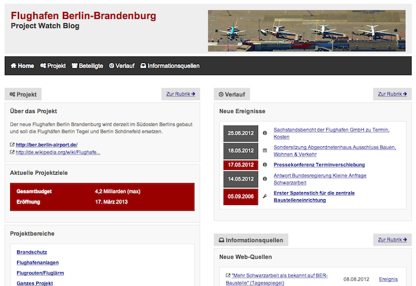

=====
Users
=====

Introduction
============

At every time around the globe a lot of big and publicly funded projects are taking place. The infrastructure
of various regions and countries is improved through new roads, airports or gas pipelines. Cities widen their
cultural offerings and reputation through new museums, art halls and stadiums. Governments let develop new
software systems for their military, police or the health care system.

While the goals of these project often sound desirable and the start of the projects is welcomed
enthusiastically by politicians or other stakeholders involved, the development process of many of these
projects tend to become problematic over time. Either the planning is unsufficiently done in the beginning,
bigger manual or technical mistakes are made during the project process or people were not sufficiently clarified 
about how the project will affect them (inhabitants near a new road e.g.). Not to mention things like 
corruption or favoritism.   

All those things far too often lead to an explosion of the originally calculated project costs and/or let the
project finishing date be shifted again and again to a future date, sometimes resulting in the project not to
be finished at all. 

At the same time it is often hard for the interested public to follow the progress of a project, holding responsible
people accountable or get involved if they learn that they are affected in some way. Information
is spread over various websites and in many cases - sometimes on purpose - not presented in a very readable/
understandable format. This software tool is aiming to help bring this spread information together by providing
a specialized content management system for administrate the different parts of a project, events occured,
people/stakeholders involved and project goals in one place. The provided data is then organized and interlinked
on the frontend site in a suitable layout and can be used as a representable website to inform the public
what is going on inside and around the project seen from a broader perspective.

Site Configuration and Layout Customization
===========================================

Text Text Text

General Project Information and Different Project Parts
=======================================================

Text Text Text

Project Goals: History of Project Goals
=======================================

Text Text Text

Participants
============

Text Text Text

Events
======

Text Text Text
