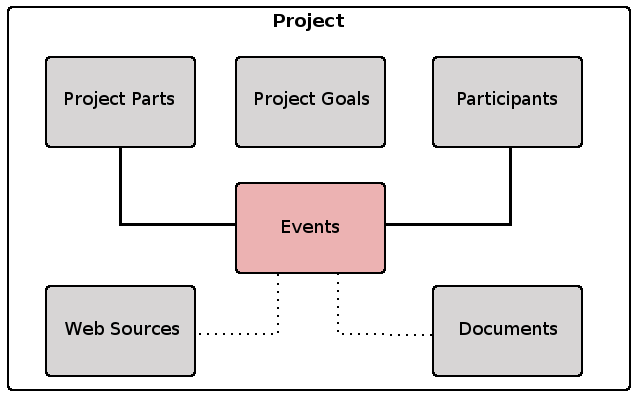
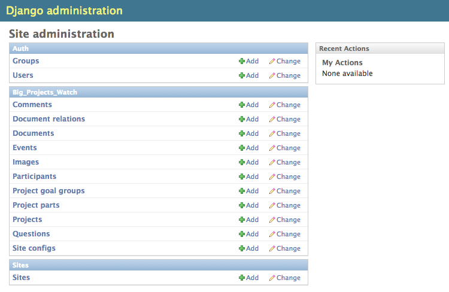

================
Users (OUTDATED)
================

Introduction
============

At every time around the globe a lot of big and publicly funded projects are taking place. The infrastructure
of various regions and countries is improved through new roads, airports or gas pipelines. Cities widen their
cultural offerings and reputation through new museums, art halls and stadiums. Governments let develop new
software systems for their military, police or the health care system.

While the goals of these project often sound desirable and the start of the projects is welcomed
enthusiastically by politicians or other stakeholders involved, the development process of many of these
projects tend to become problematic over time. Either the planning is unsufficiently done in the beginning,
bigger manual or technical mistakes are made during the project process or people were not sufficiently clarified 
about how the project will affect them (inhabitants near a new road e.g.). Not to mention things like 
corruption or favoritism.   

All those things far too often lead to an explosion of the originally calculated project costs and/or let the
project finishing date be shifted again and again to a future date, sometimes resulting in the project not to
be finished at all. 

At the same time it is often hard for the interested public to follow the progress of a project, holding responsible
people accountable or get involved if they learn that they are affected in some way. Information
is spread over various websites and in many cases - sometimes on purpose - not presented in a very readable/
understandable format. This software tool is aiming to help bring this spread information together by providing
a specialized content management system for administrate the different parts of a project, events occured,
people/stakeholders involved and project goals in one place. The provided data is then organized and interlinked
on the frontend site in a suitable layout and can be used as a representable website to inform the public
what is going on inside and around the project seen from a broader perspective.

Projects as seen by BPW
=======================

In the following image you see, how a project is structured in BPW.

A **Project** in BPW can be anything which has defined goal, some time frame for reaching that goal and different
stakeholders who are involved. I already mentioned some examples in the introductory text: an airport, a
highway, a software system. Also a law which is prepared in parliament can be seen as a project (see: :ref:`law_use_case`).
Be creative for what use cases you can use this software (and let me know!).

**Project Parts** are different structural parts of the project. The way you structure the project is up to you.
If something is build, you can use the relevant physical units (for an airport e.g.: terminals, runways,...).
This doesn't have to be neither complete nor consistent, the separation here just helps to organize information
around the project. Concentrate/start with the parts critical/relevant to be watched.

In a big project, **Project Goals** often change over time. In BPW you can provide different project goal groups,
chronologically ordered by the event where the new goals were determined, something like a meeting of the 
responsible stakeholders e.g.. Project goal groups consists of several single project goals having a name and
a performance figure, something like a budget with some amount of money or the date where the project should be
finished. You can also enter quality goals, e.g. for an airport the time night flight should be prohibited.

A **Participant** is every person/group/institution having something to do with the project. Beside the institution
actually beeing responsible for the project, this can be an NGO, a court, a citizens initiative, a parliament.

What is actually happening around a project is presented in BPW as **Events**. An event can be a meeting of
stakeholders, an important project progress, a decision by a court or a parliament or something unplanned
like a storm or a fire. For every event you can determine which project parts are affected and which participants
are involved. You can also provide additional web sources or documents for an event, e.g. for an important
meeting resulting news articles in the press or protocols being published.

Admin Interface
===============

You can provide the data for the different project areas described above in the admin interface of the BPW
installation. If you don't have installed BPW yourself, ask the tech expert of your trust how to get to the
admin, it should be something like, secured with a username/password combination::

	http://www.myprojectwatchblog.org/admin/

Inside the admin interface, you should see an overview page similar to the following:

Site Configuration
------------------
For the general site configuration you have to create a SiteConfig entry. In the site config form you
can customize some basic layout settings if you like, like the color of the header background or the
subtitle of the page. You also have to provide some basic general information, like a footer for your
page and some contact information.

.. image:: images/screenshot_admin_site_config.png

Project Data
------------
Now you can start with the project data. Create a new **Project** entry and provide some general project
information and introductory texts for the different categories of the project website, then add 
some **Project Part** entries and at least the current *Project Goals* together with the associated **Event**.
Associated with the form fields of the different data forms you find help texts with additional information
about what to enter.

.. image:: images/screenshot_admin_event.png

Herewith you have provided enough information for the frontend website to work. You can now add other important
events to trace the project progress/process or provide additional information about project parts or participants.

Frontend Website
================

The information you provide in the admin interface is organized and displayed on the frontend website,
probably a url something like::

	http://www.myprojectwatchblog.org
	
Here are a few screenshots to give you an impression of how it will look like:

.. _law_use_case:

Special Use Case: Laws
======================

Often with big publicly funded projects physical things like roads or museums are associated. But also
*laws passed by parliaments* (or the processes associated with them) have *all the characteristics of a project*:
a unique task, a concrete goal (a passed law) and a timeframe when this goal should be reached.

Laws projects have also another characteristics of big projects: they sometimes tend to happen in a not so
transparent way, not taking the interests of all of the stakeholders into account and leaving some doubt
about what motivations drive the responsible actors. One of the latest examples of problematic law making
processes is the controversy about the ACTA trade agreement, which should have been made to law in the
European Union.

BPW can also be used to monitor such law making processes.
